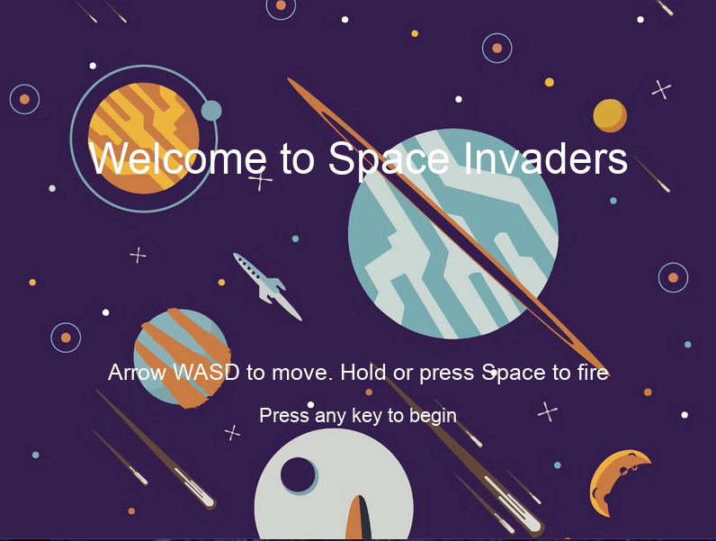
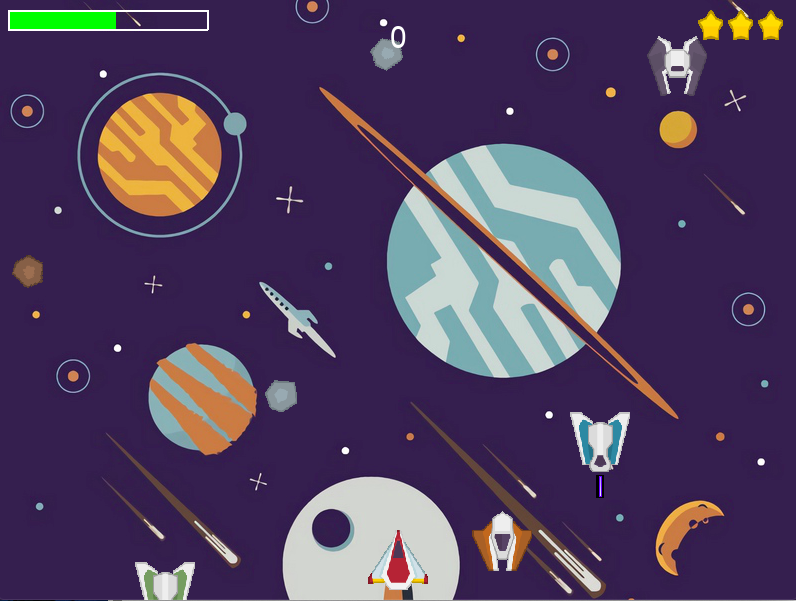

# ℹ️ Space Game
The space shooter using Python 3 and Library Pygame.



## :o: INDEX
* [Requirements](https://github.com/diable201/Space_Game#%EF%B8%8F-requirements)
* [Screenshots](https://github.com/diable201/Space_Game#camera-screenshots)
* [Game Features](https://github.com/diable201/Space_Game#-game-features)
* [Controls](https://github.com/diable201/Space_Game#-controls)
* [Installation](https://github.com/diable201/Space_Game#-installation)
* [License](https://github.com/diable201/Space_Game#copyright-license)

## ❗️ Requirements
- :arrow_up: [[Back to top]](https://github.com/diable201/Space_Game#o-index)

	Library Pygame:
	```console
	$ pip install pygame
	```
	Python3:

	```console
	$ python3 -V
	Python 3.7.7
	```

## :camera: Screenshots
- :arrow_up: [[Back to top]](https://github.com/diable201/Space_Game#o-index)



## 🎆 Game Features
- :arrow_up: [[Back to top]](https://github.com/diable201/Space_Game#o-index)

### :rocket: Gameplay :
* Health bar for the space ship
* Score board
* Power Up (FirstAidKit)
* Random sprites for
	* Explosions
	* Enemies
	* Player
	* Shots
* 3 Lives per game

### :headphones: Sound :
* Music and sound for:
	* Explosions
	* Shots
	* Power Up
	* OST

## 🤘 Controls
- :arrow_up: [[Back to top]](https://github.com/diable201/Space_Game#o-index)

|              | Button              |
|--------------|---------------------|
| Move Up   | <kbd>W</kbd>    |
| Move Down   | <kbd>S</kbd>    |
| Move Left    | <kbd>A</kbd>     |
| Move Right   | <kbd>D</kbd>   	|
| Fire (Press or Hold) | <kbd>spacebar</kbd> |
| Quit game    | <kbd>Esc</kbd>      |

##  🔧 Installation
- :arrow_up: [[Back to top]](https://github.com/diable201/Space_Game#o-index)
### Build from source

```console
$ git clone https://github.com/diable201/Space_Game.git
$ cd Space_Game-master/
$ python3 main.py
```

## :copyright: License
- :arrow_up: [[Back to top]](https://github.com/diable201/Space_Game#o-index)

With :heart: by GitHub and open-source community.

This game is open-sourced software licensed under the  [The Open Software License 3.0 (OSL-3.0)](https://opensource.org/licenses/OSL-3.0)
